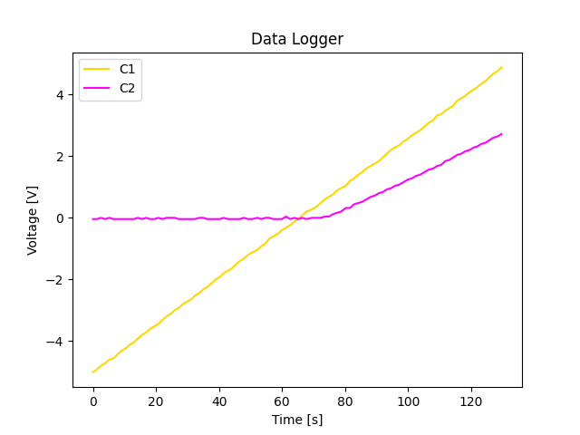
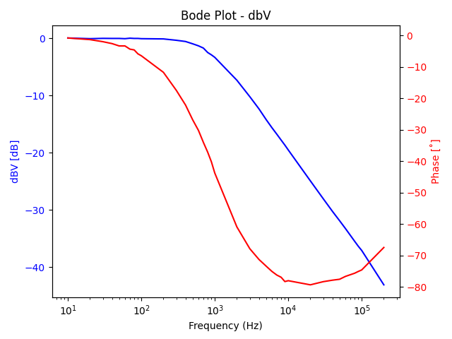
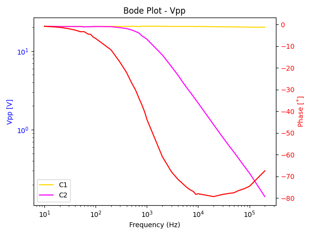

# Home Electronics Lab

Controlling the Siglent SDS1104X-U oscilloscope and SDG1032X Arbitrary Waveform Generator with SCPI.

Prerequisites:

- `pip3 install -U pyvisa`
- `pip3 install -U matplotlib`

## Data Logger

Samples active oscilloscope channels in Roll mode at the trigger point. Outputs each sample's timestamp, elapsed time, and voltage of the active channels to `stdout` in CSV format. Optionally plots the output. It is assumed that each channel is set up with the optimal vertical scale and position. Can also be used in combination with the AWG by having it step through a range of voltages before each sample. In this mode it should be used with a timebase of at most 1ms per division, not in Roll mode.

	usage: datalogger.py [-h] [-i interval] [-n limit] [-p] [-awg awgchannel] [-vmin vmin] [-vmax vmax]
	
	Data Logger
	
	optional arguments:
	-h, --help       show this help message and exit
	-i interval      Sample interval in seconds (default is 1)
	-n limit         Maximum number of samples (default is unlimited)
	-p               Plot samples (only available with sample limit)
	-awg awgchannel  AWG output channel ([1,2], AWG off by default)
	-vmin vmin       AWG minimum DC voltage (default is 0)
	-vmax vmax       AWG maximum DC voltage (default is 1)
	
	Output timestamp, elapsed time, and voltage of active scope channels at trigger point with SDS1104X-U. Optionally change SDG1032X DC voltage before taking each sample.

## Bode Plot

The SDS1104X-U omits the bode plot feature of the SDS1104X-E, which has it control an external Siglent AWG to sweep a sine wave across a range of frequencies while measuring the input to and output from a device under test (DUT). At each frequency point, gain and phase are measured and displayed on the plot.

`bodeplot.py` creates similar functionality for the SDS1104X-U and SDG1032X. To use it:

1. Enable channel tracking on the AWG by selecting *Utility > CH Copy Coupling > Track ON*;
1. Connect AWG channel 1 to the input of the DUT;
1. Connect AWG channel 2 to DSO channel 1;
1. Connect DSO channel 2 to the output of the DUT.

Enter `bodeplot.py -amp 10 -a1 1`

This has the DSO measure the Vpp of channel 1 and 2 as well as their phase difference while the AWG sweeps a 10 Vpp sine wave from 1 kHz to 100 kHz. It writes the measurements to `stdout` in CSV format, and plots the results. Because AWG channel 2 is directly connected to DSO channel 1, its probe attenuation is set to 1 in this example. If you do not use channel coupling and use a 10x probe instead, then the `-a1` argument can be omitted. 

	usage: bodeplot.py [-h] [-in inchannel] [-out outchannel] [-awg awgchannel] [-amp amplitude] [-fs startfreq] [-fe endfreq] [-a1 attenuation] [-a2 attenuation] [-q quality]
	[-d delay]
	
	Bode Plot
	
	optional arguments:
	-h, --help       show this help message and exit
	-in inchannel    DSO channel for AWG output ([1-4], default is 1)
	-out outchannel  DSO channel for DUT ([1-4], default is 2)
	-awg awgchannel  AWG output channel ([1,2], default is 1)
	-amp amplitude   AWG sine wave amplitude in V (default is 1)
	-fs startfreq    Sweep start frequency in Hz (default is 1000)
	-fe endfreq      Sweep end frequency in Hz (default is 100000)
	-a1 attenuation  Probe attenuation factor for inchannel (default is 10)
	-a2 attenuation  Probe attenuation factor for outchannel (default is 10)
	-q quality       Output quality ([1-10], default is 1)
	-d delay         Delay between measurements in seconds (default is 0)
	
	Creates Bode Plot and CSV output using SDS1104X-U and DSG1032X.

The `-d` argument is useful if Average acquisition mode is used, to have it settle down for a few seconds before the Vpp and phase is measured.

# SCPI Utility

SCPI utility for SDS1104X-U and DSG1032X.

For example, `./scpi.py dso -q "C1:PAVA? PKPK"` or `./scpi.py dso -q "C1-C2:MEAD? PHA" -x`.

	usage: scpi.py [-h] [-q query] [-c command] [-x] target
	
	SCPI Utility
	
	positional arguments:
	target      Target instrument (one of 'dso' or 'awg')
	
	optional arguments:
	-h, --help  show this help message and exit
	-q query    SCPI query
	-c command  SCPI command
	-x          Output query result as byte array
	
	Submit SCPI command or query to SDS1104X-U or DSG1032X.
